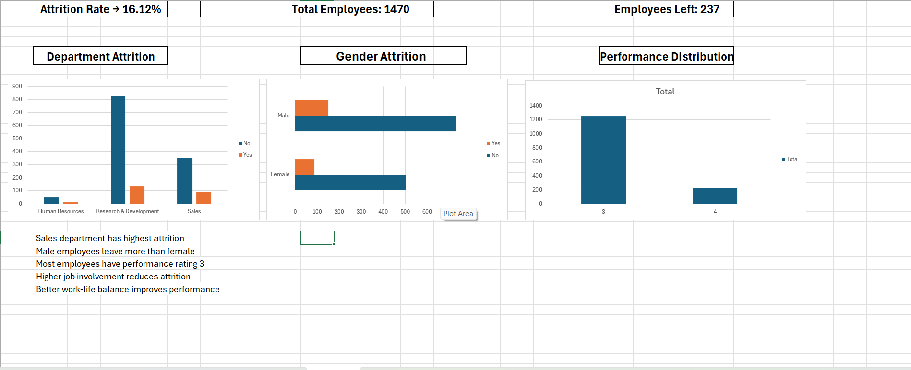

# 📊 HR Attrition Analysis

## 📌 Project Background

Adecco India is a medium-sized technology company specializing in software development. It has a diverse workforce across departments such as engineering, marketing, sales, and customer support.

Recently, the organization has observed an increase in employee turnover, particularly among junior-level employees. This trend has raised concerns within management.

The company aims to analyze the key factors influencing employee attrition and job satisfaction in order to develop effective strategies for improving employee engagement and retention.

---

## 🎯 Objective

To analyze employee data and identify patterns contributing to attrition, enabling data-driven decision-making for workforce retention.

---

## 🛠 Tools Used

* Microsoft Excel (Data Cleaning, Pivot Tables, Dashboard)

---

## 📂 Files Included

* **Sample data Hr.xlsx** → Dataset
* **Shubhra_Mishra.Excel_project_sol_2.xlsx** → Analysis & dashboard
* **HR_Attrition_Analysis_DashBoard.png** → Dashboard preview

---

## 📊 Dashboard Preview

---

## 📈 Key Insights

* Higher attrition observed among junior-level employees
* Certain departments show higher turnover rates
* Job satisfaction and salary may influence attrition trends

---

## 🚀 Conclusion

This project helps identify the underlying causes of employee attrition and provides insights that can support better HR decision-making and employee retention strategies.
